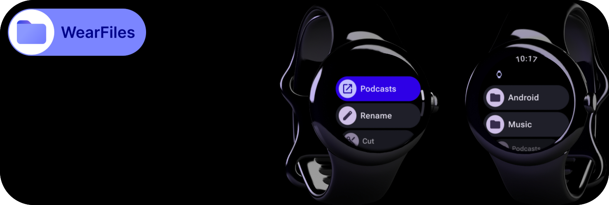
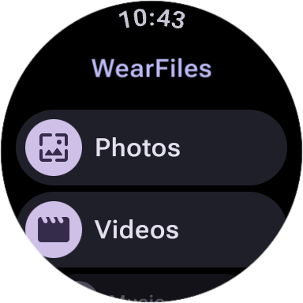
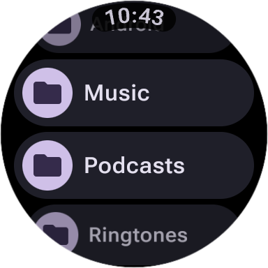
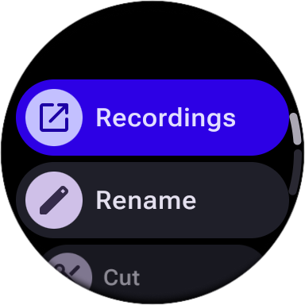
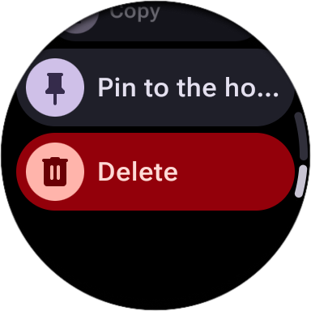
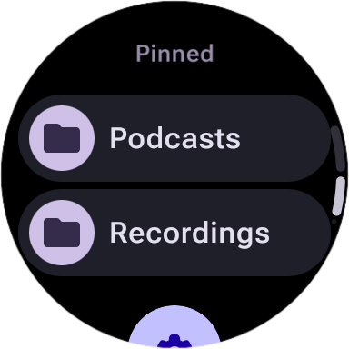

  

# WearFiles

A simple open-source file manager designed for Wear OS ⌚

### App Features:

- File transfer from phone to watch ⌚➡️📱
- View, open, delete files on Wear OS device 📂
- Clipboard: cut / copy / paste 📋
- Pin files and folders to the main screen 📌
- Built-in image viewer 🖼️
- Built-in PDF viewer 📄

### Screenshots

  
    
    
    
    
    

  

### File transfer from phone to watch:

You can transfer files from your smartphone to your watch. To do this, install the app on both devices and make sure the connection with the watch is established.

  

### ⚠️ File Access Permission ⚠️

To use the app on your watch as a file manager, you need to grant file access permission: `MANAGE_EXTERNAL_STORAGE`. Due to Wear OS platform limitations, the app cannot request this permission on its own.
However, you can use the app without it in a limited mode. You probably **don't need full file access if you just want to transfer a file from your phone and open it on your watch**.

#### What works without `MANAGE_EXTERNAL_STORAGE` permission:

- "Photos": view the list of images stored on the device
- "Videos": videos stored on the device
- "Music": list of audio files on the device
- "Received": files received from the phone
- Opening the above files (if software to open these file types is available)

#### How to grant permission manually:
If you decide that you need full access to files, you can grant permission using ADB:

1. Connect the watch to the computer via ADB
2. Run the command:  
   ``adb shell appops set --uid com.dertefter.wearfiles MANAGE_EXTERNAL_STORAGE allow``
3. Restart the app

### 💎 Support me
If you find this project useful, you can support its development via TON:  
`UQBvmXutAO5dEIwf46dP-TMaA_DqsGkLFkxrDxThIfdTLSE3`
