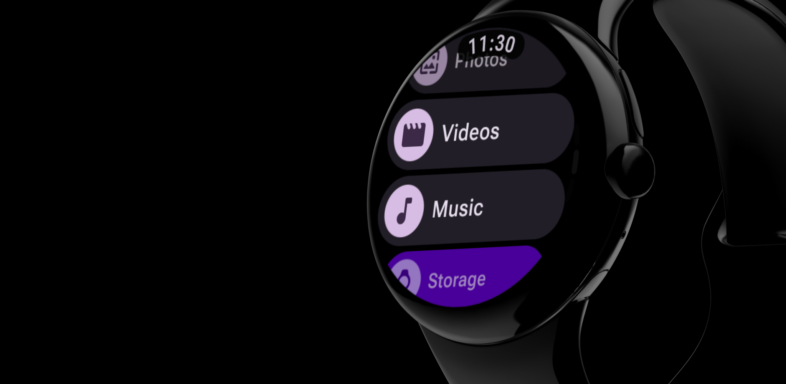

# WearFiles

 

[](https://play.google.com/store/apps/details?id=com.dertefter.wearfiles)



Simple file manager for Wear OS smartwatches.

## Features
- View and open files
- Delete files
- Cut/Copy/Paste files

## Important
- Due to Wear OS platform limitations, the application cannot automatically grant the MANAGE_EXTERNAL_STORAGE permission. You need to do this manually. This permission is necessary to access the device's file system.
- You will be able to use the application without this permission in a limited mode. You will have access to viewing a list of photos, videos, and audio files.

### How to manually grant access to files:  
1. Connect your watch to a computer via ADB.
2. Run the following command:

   ```sh
   adb shell appops set --uid com.dertefter.wearfiles MANAGE_EXTERNAL_STORAGE allow
   ```

3. Restart the app.

## 📸 Screenshots

  

## 💎 Support
If you find this project useful, you can support its development via TON:

`UQBvmXutAO5dEIwf46dP-TMaA_DqsGkLFkxrDxThIfdTLSE3`

